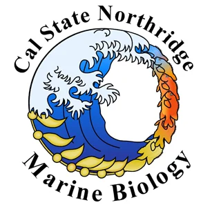

# 

# TidyTuesday - CSUN

Peer coding group to help people work on their data wrangling and plotting skills and to create a supportive and low stress environment for working on coding issues together.

Coordiating this group with an already established international group of R enthusiasts that have started a weekly data project called "TidyTuesday".
